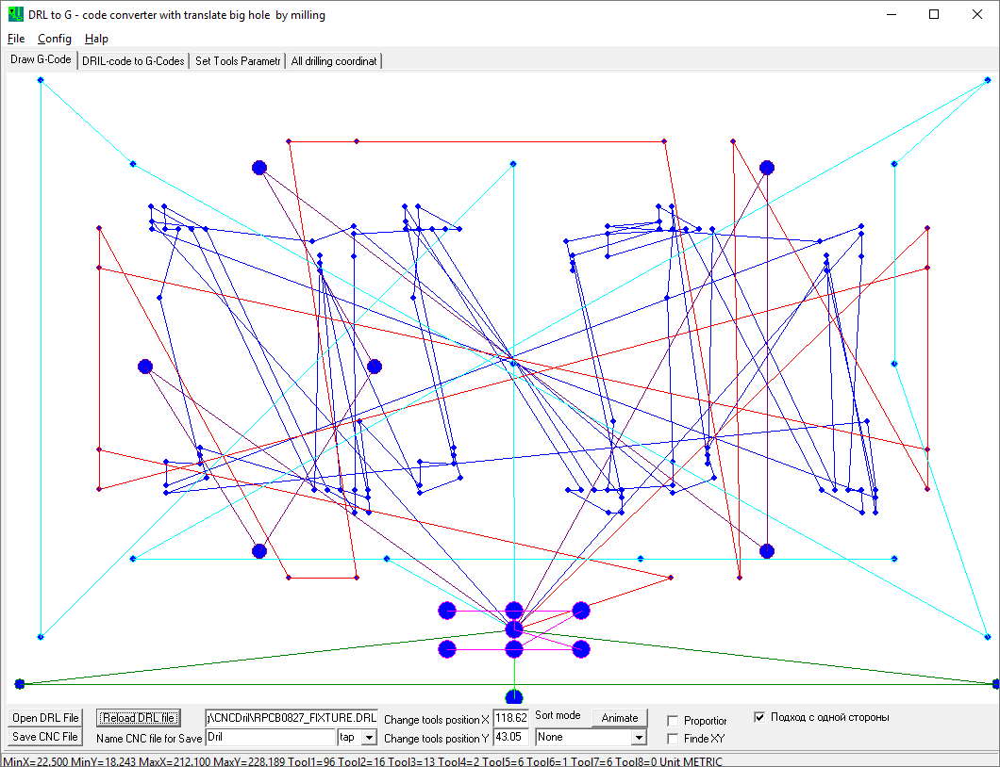
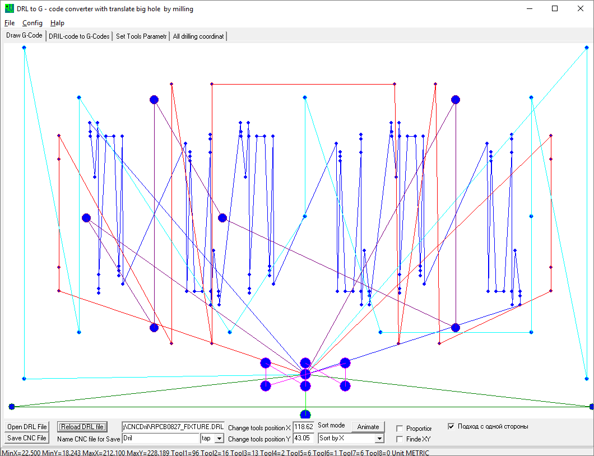
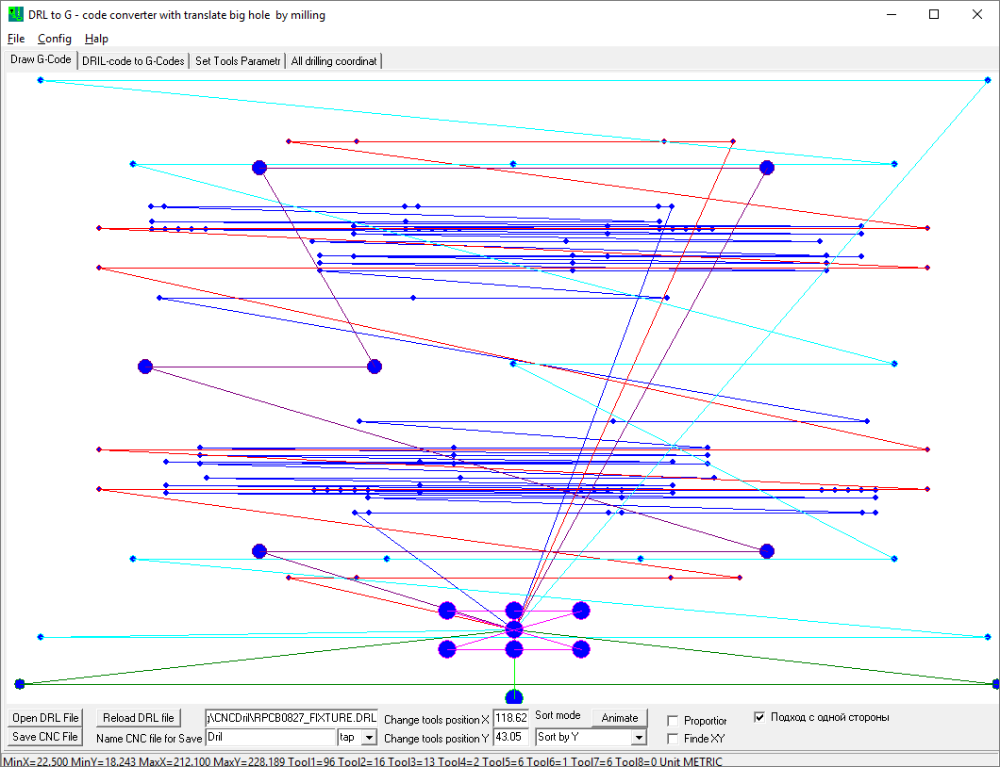
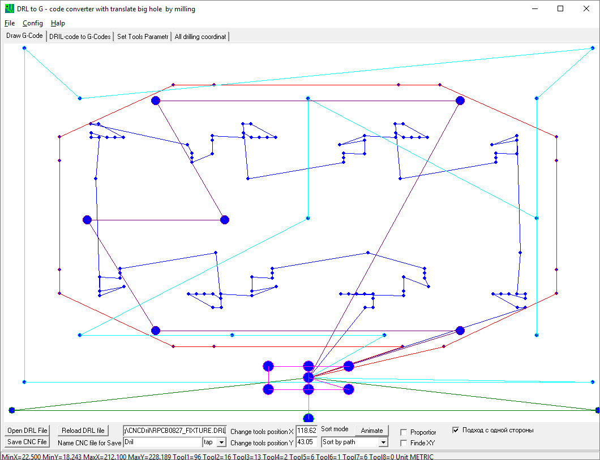
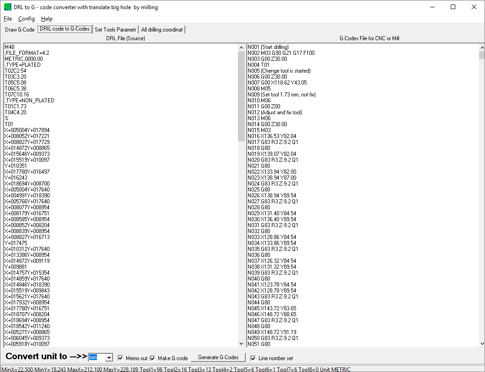
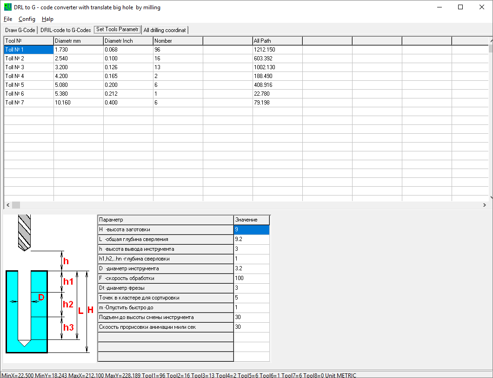
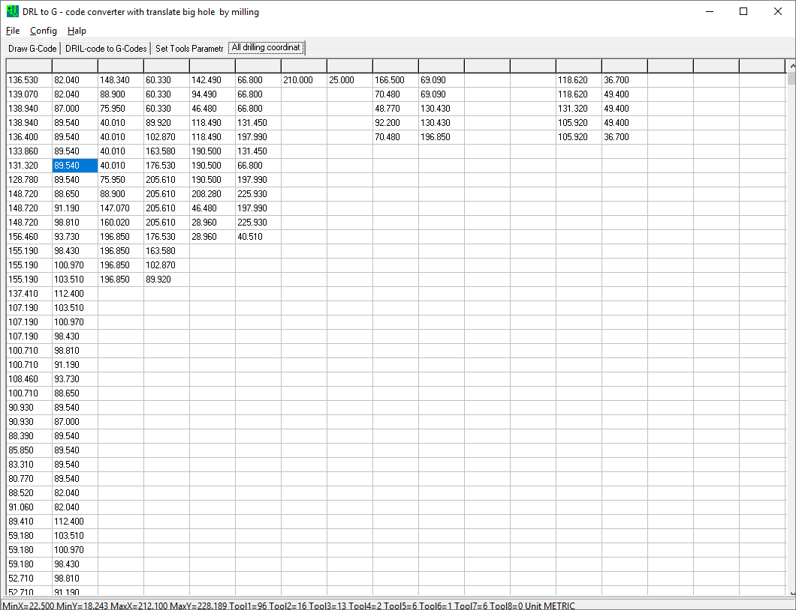
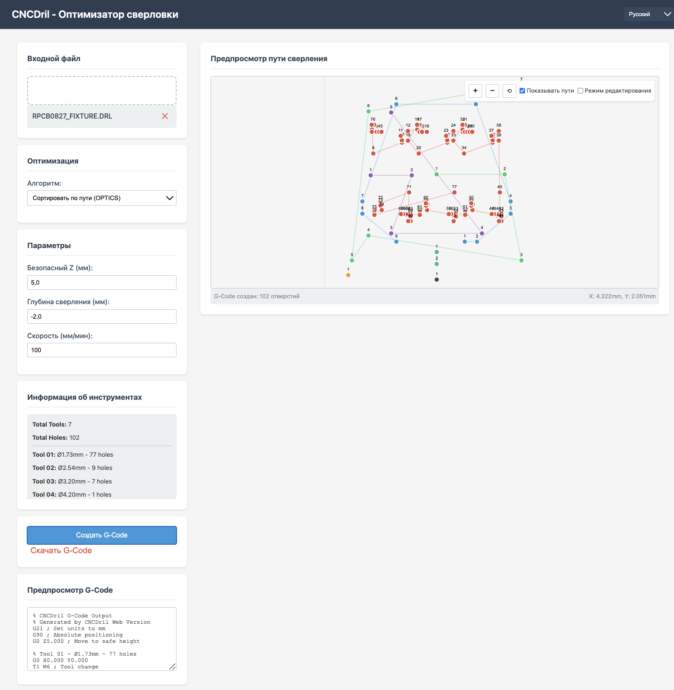
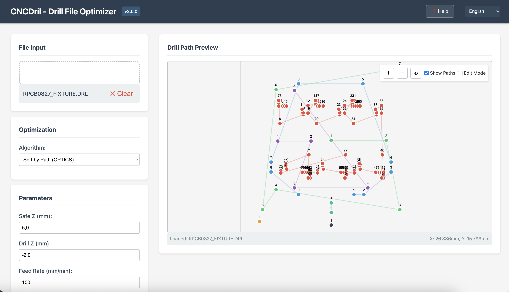
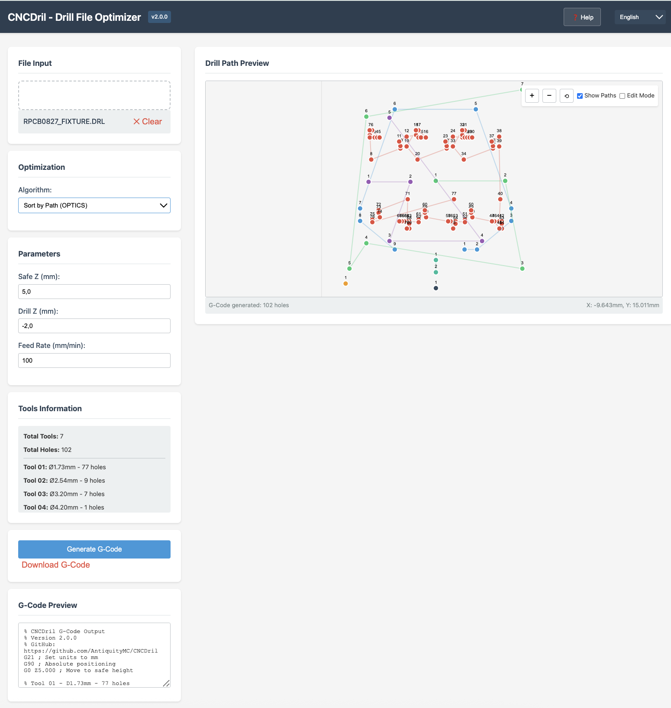

# CNCDril - Оптимізатор свердління для ЧПУ

Мультиплатформний оптимізатор сверловочних файлів для перетворення P-CAD/Altium .drl файлів в оптимізований G-Code для ЧПУ верстатів.

## Особливості

- **Кілька платформ**: Delphi VCL, Python CLI/GUI, Node.js CLI, веб-версія та автономна HTML версія
- **Алгоритми оптимізації**:
  - SortByX: Сортування отворів за координатою X
  - SortByY: Сортування отворів за координатою Y
  - SortByPath (OPTICS): Оптимізація на основі відстані
- **Візуалізація**: Інтерактивний попередній перегляд шляху свердління з анімацією
- **Мультимовність**: Підтримка 6 мов (EN, RU, UK, PT, DE, FR)
- **Кросплатформеність**: Windows, Linux, macOS та веб-браузери

## Версії

### Версія Delphi (оригінал)
- **Розташування**: `delphi/`
- **Вимоги**: Delphi 6.0 або вище
- **Особливості**: Повнофункціональна десктопна програма VCL
- **Використання**: Відкрити `CNCDril.dpr` в IDE Delphi та скомпілювати

### Версія Python
- **Розташування**: `python/`
- **Вимоги**: Python 3.7+, matplotlib, numpy
- **Особливості**: CLI та GUI інтерфейси
- **Тести**: `python/test_cncdril.py` (13 тестів)
- **Встановлення**: Див. `python/README.md`

### Версія Node.js
- **Розташування**: `nodejs/`
- **Вимоги**: Node.js 14+ (нуль залежностей)
- **Особливості**: CLI з підтримкою 6 мов, ті ж алгоритми що й в інших версіях
- **Тести**: `nodejs/test/test.mjs` (13 тестів)
- **Використання**: `node cncdril.mjs input.drl -o output.nc`

### Веб-версія
- **Розташування**: `web/`
- **Вимоги**: Сучасний веб-браузер (сервер не потрібен)
- **Особливості**: Drag-and-drop, інтерактивна візуалізація, мультимовність
- **Тести**: `web/test/test.mjs` (10 тестів)
- **Використання**: Відкрити `web/index.html` в браузері

### Автономна HTML версія
- **Розташування**: `standalone/cncdril.html`
- **Вимоги**: Лише сучасний веб-браузер — без сервера, без встановлення
- **Особливості**: Один автономний HTML файл з усіма CSS та JavaScript вбудованими
- **Використання**: Відкрити `standalone/cncdril.html` безпосередньо в будь-якому браузері (працює через протокол file://)
- **Та сама функціональність** що й у веб-версії: парсинг DRL, 3 алгоритми оптимізації, генерація G-Code, інтерактивна візуалізація на canvas, 6 мов

## Швидкий старт

### Версія Delphi
1. Відкрити `delphi/CNCDril.dpr` в IDE Delphi
2. Скомпілювати та запустити
3. Завантажити .drl файл та згенерувати G-Code

### Версія Python
```bash
cd python
pip install -r requirements.txt
python cncdrill.py ../examples/RPCB0827_FIXTURE.DRL -o output.nc
```

### Версія Node.js
```bash
cd nodejs
node cncdril.mjs ../examples/RPCB0827_FIXTURE.DRL -o output.nc

# З вказівкою мови
node cncdril.mjs ../examples/RPCB0827_FIXTURE.DRL --language uk -o output.nc
```

### Веб-версія
```bash
cd web
python -m http.server 8000
# Перейти на http://localhost:8000
```

### Автономна HTML версія
Відкрити `standalone/cncdril.html` в будь-якому сучасному веб-браузері. Сервер не потрібен.

## Тестування

### Запуск всіх тестів
```bash
# Тести Node.js CLI (13 тестів)
node nodejs/test/test.mjs

# Тести веб-модулів JS (10 тестів)
node web/test/test.mjs

# Тести Python (13 тестів)
cd python && python -m unittest test_cncdril -v
```

### Покриття тестами
| Версія | Тести | Покриття |
|--------|-------|----------|
| Node.js CLI | 13 | Довідка, версія, парсинг, генерація G-Code, всі 6 мов, обробка помилок |
| Веб-модулі JS | 10 | Point, Tool, DRLParser, всі 3 алгоритми оптимізації |
| Python | 13 | Парсинг, діаметри інструментів, SortByX/Y, OPTICS, генерація G-Code, вивід у файл |

## Формат файлів

### Вхід (.drl)
Сверловочні файли P-CAD/Altium:
- Визначення інструментів (T01C1.73)
- Координатні дані (X+005004Y+017894)
- Метричні та дюймові одиниці
- Кілька інструментів в файлі

### Вихід (.nc)
Стандартний G-Code для ЧПУ:
- Команди зміни інструменту (T1 M6)
- Рухи по безпечній висоті (G0 Z5.0)
- Операції свердління (G1 Z-2.0)
- Сумісність з більшістю ЧПУ контролерів

## Приклад

Директорія `examples/` містить `RPCB0827_FIXTURE.DRL`:
- 7 інструментів (Ø1.73mm до Ø10.16mm)
- 102 отвори всього
- Метричні одиниці

## Оптимізація

Алгоритм OPTICS (Ordering Points To Identify the Clustering Structure) мінімізує відстань переміщення інструменту:
1. Знаходить найближче невідвідане отвір
2. Переміщується до цього отвору
3. Повторює поки всі отвори не будуть відвідані

Це зазвичай зменшує загальну відстань переміщення на 30-50% порівняно з несортованими шляхами.

## Мультимовність

Всі версії підтримують:
- Англійську (EN)
- Російську (RU)
- Українську (UK)
- Португальську (PT)
- Німецьку (DE)
- Французьку (FR)

Мова за замовчуванням - англійська у всіх версіях.

## Структура репозиторію

```
CNCDril/
├── README.md              # Цей файл (англійська)
├── README.RU.md           # Документація російською
├── README.UA.md           # Документація українською
├── README.PT.md           # Документація португальською
├── README.DE.md           # Документація німецькою
├── README.FR.md           # Документація французькою
├── .gitignore             # Правила Git ignore
├── LICENSE                # MIT Ліцензія
│
├── delphi/                # Оригінальний додаток Delphi
│   ├── CNCDril.dpr        # Файл проєкту
│   ├── CNCDril_r01.pas    # Основний вихідний код
│   ├── CNCDril_r01.dfm    # Визначення форми
│   ├── CNCDril.res        # Ресурси
│   └── README.md          # Документація Delphi
│
├── python/                # Реалізація на Python
│   ├── cncdrill.py        # CLI додаток
│   ├── cncdrill_gui.py    # GUI додаток
│   ├── test_cncdril.py    # Набір тестів (13 тестів)
│   ├── requirements.txt   # Залежності
│   └── README.md          # Документація Python
│
├── nodejs/                # Реалізація Node.js CLI
│   ├── cncdril.mjs        # CLI додаток
│   ├── package.json       # Конфігурація пакету
│   ├── test/
│   │   └── test.mjs       # Набір тестів (13 тестів)
│   └── README.md          # Документація Node.js
│
├── web/                   # Веб-додаток (багатофайловий)
│   ├── index.html         # Основний інтерфейс
│   ├── styles.css         # Стилі
│   ├── locales.js         # Переклади
│   ├── parser.js          # Парсер DRL
│   ├── optimizer.js       # Алгоритми оптимізації
│   ├── gcode-generator.js # Генерація G-Code
│   ├── ui.js              # Візуалізація на canvas
│   ├── cncdrill.js        # Основний додаток
│   ├── test/
│   │   └── test.mjs       # Набір тестів (10 тестів)
│   └── README.md          # Документація веб-версії
│
├── standalone/            # Автономний HTML (один файл)
│   └── cncdril.html       # Автономний файл (сервер не потрібен)
│
└── examples/              # Приклади файлів
    └── RPCB0827_FIXTURE.DRL
```

## Порівняння версій

| Функція | Delphi | Python | Node.js | Web | Автономна HTML |
|---------|--------|--------|---------|-----|----------------|
| Десктоп GUI | Так | Так | Ні | Ні | Ні |
| Командний рядок | Ні | Так | Так | Ні | Ні |
| Веб-інтерфейс | Ні | Ні | Ні | Так | Так |
| Візуалізація | Так | Так | Ні | Так | Так |
| Автономна робота | Так | Так | Так | Так | Так |
| Кросплатформеність | Windows | Так | Так | Так | Так |
| Встановлення | Необхідне | Необхідне | Node.js | Немає | Немає |
| Потрібен сервер | Ні | Ні | Ні | Опціонально | Ні |
| Один файл | Ні | Ні | Так | Ні | Так |
| Тести | — | Так 13 | Так 13 | Так 10 | — |
| Продуктивність | Найкраща | Добра | Добра | Добра | Добра |

## Ліцензія

MIT License - Див. файл LICENSE для деталей

## Внесок

Внески вітаються! Будь ласка, переконайтеся що:
- Код відповідає домовленостям проєкту
- Всі алгоритми оптимізації відповідають реалізації Delphi
- Вихідний G-Code перевірено
- Підтримка мультимовності збережена
- Документація оновлена
- Тести додані для нових функцій

## Автори

- Оригінальна версія Delphi: [Оригінальний автор]
- Реалізація Python/Web/Node.js: [Учасники]

## Подяки

- Реалізація алгоритму OPTICS
- Підтримка формату файлів P-CAD/Altium
- Відгуки та тестування від спільноти ЧПУ

## Скріншоти

### Додаток Delphi

|Скріншот|Опис|
|---|---|
||Головне вікно|
||Сортування за X|
||Сортування за Y|
||Сортування за шляхом (OPTICS)|
||Вихідний код|
||Параметри інструментів|
||Усі координати свердління|

### Web-додаток v2.0

|Скріншот|Опис|
|---|---|
||Web інтерфейс - Головний вид|
||Web інтерфейс - Генерація G-Code|
||Web інтерфейс - Візуалізація|

## Історія версій

- **v1.0** - Оригінальна реалізація на Delphi
- **v2.0** - Додано версії Python CLI/GUI, Node.js CLI, Web та автономну HTML версію
