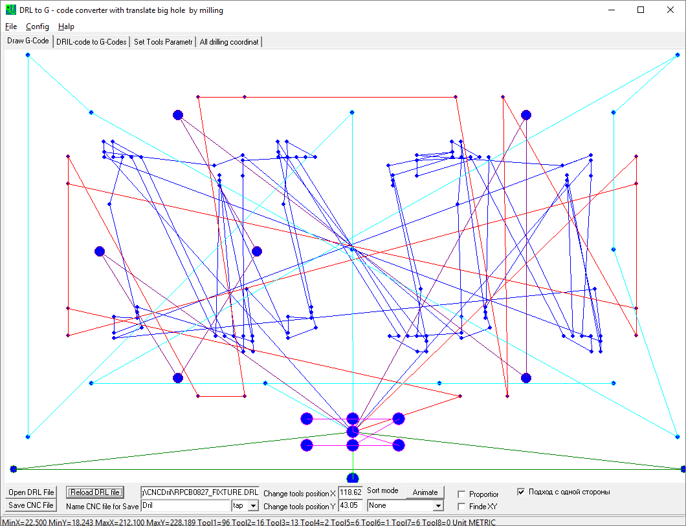
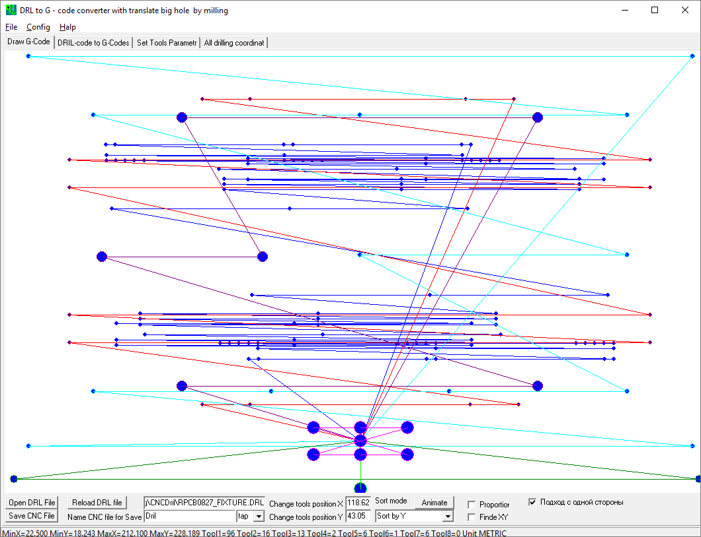
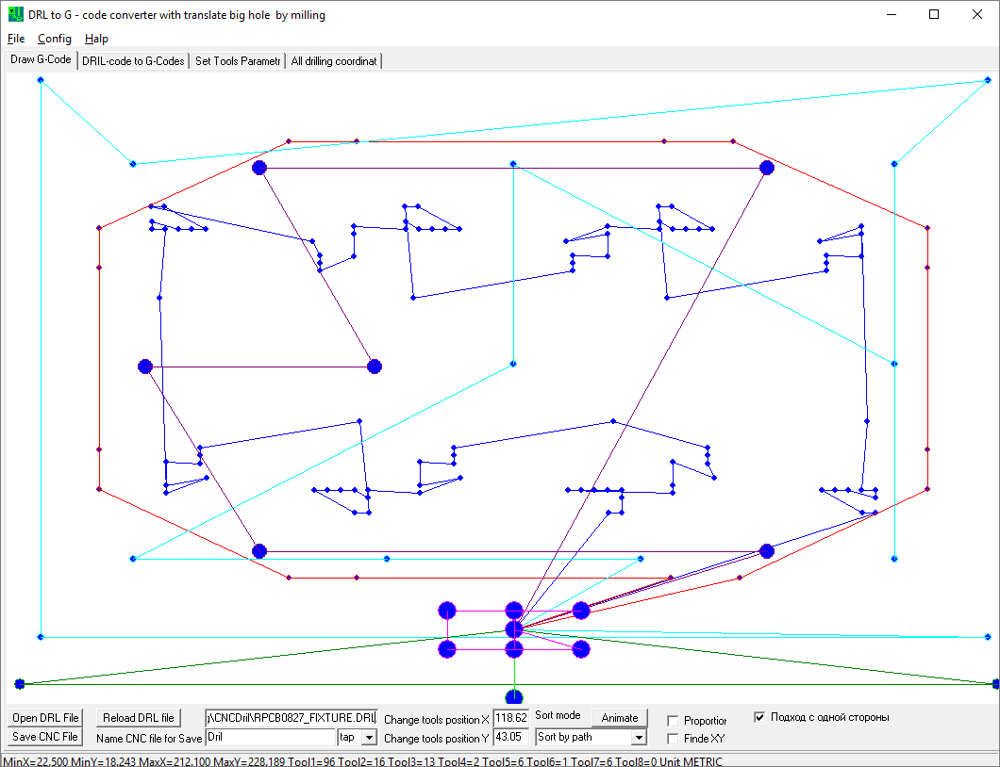
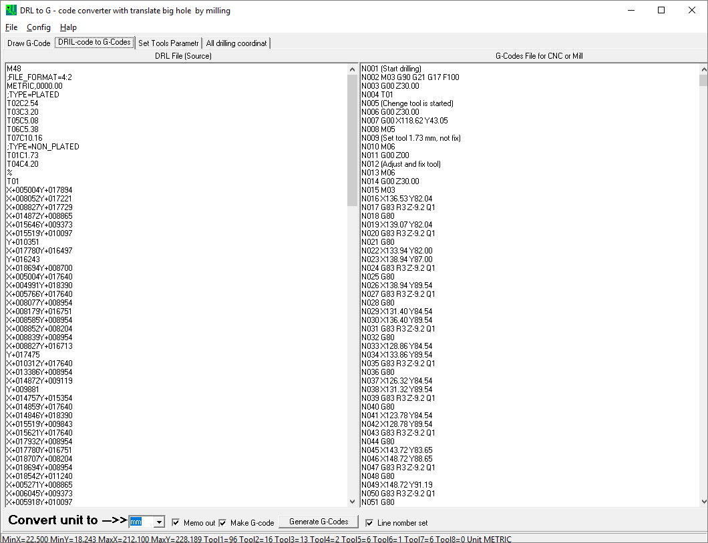
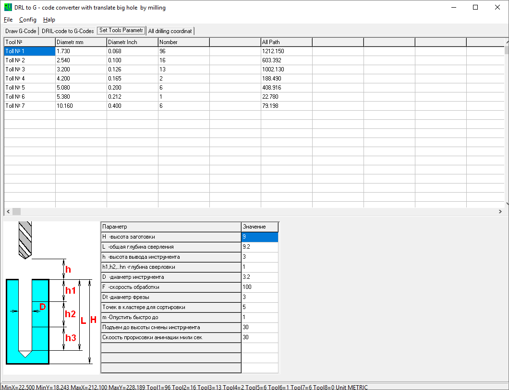
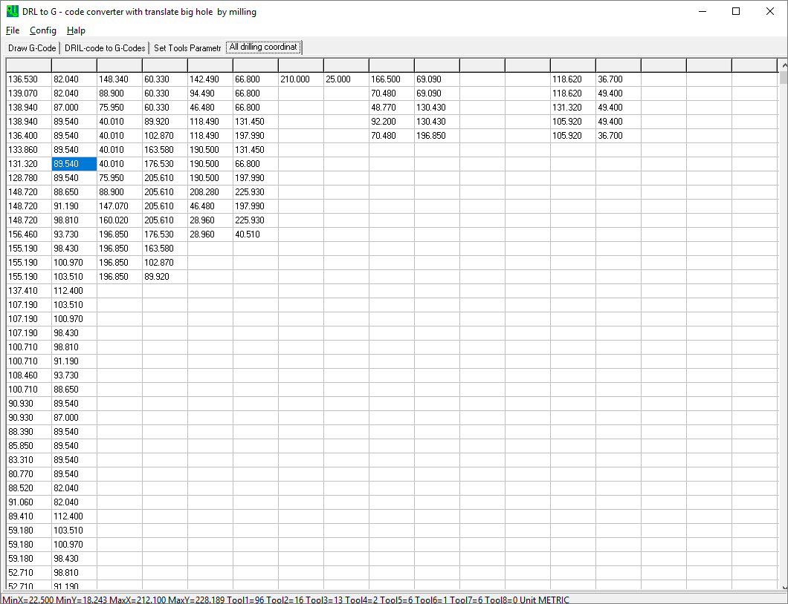

# CNCDril
Convertor of DRL (P-CAD, Altium) drill files to G-Code (CNC) with different optimization methods.

This repo contains source files for Delphi 6.0.
> Содержит исходные файлы программы для Делфи 6.0.

### Program Description / Описание программы
**The program converts the drill files (.drl) from P-CAD or Altium to G-Code CNC**
>**Программа конвертирует файл сверловки .drl из P-CAD или Altium в G-Code CNC**

It is possible to select the optimization mode for drill movement. To compensate the accuracy of the machine, you can select the drill entry mode from one side in X and Y.
>Есть возможность выбрать режим оптимизации перемещения сверла. Для компенсации выработки точности станка можно выбрать режим захода на сверловку с одной стороны по X и Y.

**Change tools position X, Y**
Coordinates, where spindle moved to, to change the drill, to fed
> Координаты, куда подводится шпиндель для смены сверла

Examples / Примеры:

The mode with route optimization by using Optics classification algorithm.
> Режим с оптимизацией маршрута по алгоритму Optics:

Example / Пример:

**The window for the source file for drilling and the resulting code for the machine.**
> **Окно исходного файла сверловки и результирующего кода для станка.**

**Adjust drilling parameters. When you select an option, the picture shows what it affects.**
> **Настройка параметров сверления. При выборе параметра, картинка показывает, на что он влияет.**

**All the coordinates of the centers of the holes, two columns (X,Y) per tool.**
> **Все координаты центров отверстий, по две колонки (X,Y) на инструмент.**

