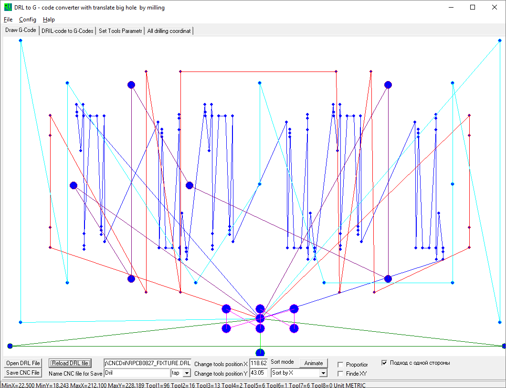

# CNCDril
Converting a DRL file to a T-code file with optimization

This repo contain source files for Delphi 6.0
This is just a working example.

Содержит исходные файлы программы для Делфи 6.0
Это всего лишь работающий пример.

### Описание программы
**Программа конвертирует файл сверловки .drl из P-CAD и Altium в G-Code CNC**
**The program converts the drill file .drl from P-CAD and Altium to G-Code CNC**

---
В программе есть возможность выбрать режим оптимизации перемещения сверла.
Для компенсации выработки точности станка можно выбрать режим захода на
сверловку с одной стороны по x и y.
---
In the program it is possible to select the optimization mode for moving
the drill. To compensate for the accuracy of the machine, you can select
the drill entry mode from one side in x and y.
---
**Chenge tools position X, Y - в эти координаты подводится шпиндель для смены сверла.
/ in these coordinates the spindle for changing the drill is fed.**

**Example for file** 
---

---

---

---

**Режим с оптимизацией маршрута по алгоритму Optics.**
---
**The mode with route optimization by the Optics classification algorithm.**
---

---

**Окно исходного файла сверловки и результирующего кода для станка.**
---
**The window for the source file for drilling and the resulting code for the machine.**
---

---

**Настройка параметров сверления. При выборе параметра, картинка показывает, на что он влияет.**
---
**Adjust drilling parameters. When you select an option, the picture shows what it affects.**
---

---

**Все координаты центров отверстий, по две колонки (X,Y) на инструмент.**
---
**All the coordinates of the centers of the holes, two columns (X,Y) per tool.**
---

---

